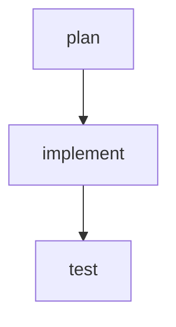

# Especificação Técnica — Agentswarm

## 1. Resumo executivo

Este documento especifica uma engine simples de orquestração de workflows baseados em YAML para execução local via CLI. O objetivo é permitir que usuários descrevam fluxos de agent coding como DAGs compostas por nós de agente, comandos shell, transformações, fan-out/fan-in e controle de paralelismo.

A primeira versão será implementada em Go, seguindo arquitetura hexagonal. No MVP, o único provider de agente será Codex via `github.com/diasYuri/go-codex-sdk` local path (~/git/diasYuri/go-codex-sdk). A engine deve isolar o SDK por meio de uma porta interna para permitir futuros providers, como Claude, OpenAI Responses API, agentes locais ou runners remotos. A lib `suture` será usada para supervisionar serviços internos da engine, como dispatcher, worker pools, event bus e lifecycle do run.

A primeira versão não terá servidor, UI ou execução distribuída. A interface primária será uma CLI.

---

## 2. Objetivos

### 2.1 Objetivos do MVP

Construir uma engine local capaz de:

1. Ler workflows em YAML.
2. Validar estrutura, dependências e tipos de nós.
3. Gerar um plano de execução acíclico.
4. Executar nós em ordem topológica.
5. Suportar nós dos tipos:
   - `agent`
   - `bash`
   - `transform`
   - `noop`
6. Suportar `depends_on`.
7. Suportar `when` com expressão limitada.
8. Suportar `for_each` para fan-out dinâmico.
9. Suportar `concurrency` por node e por workflow.
10. Agregar outputs de nós expandidos.
11. Emitir eventos estruturados em JSONL.
12. Persistir artefatos e logs do run em diretório local.
13. Executar via CLI.
14. Encapsular Codex atrás de uma interface interna.
15. Usar `suture` para supervisionar componentes internos de longa duração durante o run.

### 2.2 Não objetivos do MVP

Fora de escopo para a primeira versão:

1. Execução distribuída.
2. UI web.
3. Multi-tenant.
4. Scheduler remoto.
5. Banco de dados externo.
6. Retomada de runs interrompidos.
7. Subworkflows remotos.
8. Controle avançado de permissões.
9. Sandboxing forte com isolamento por container.
10. Cache de resultados.
11. GraphQL/REST API.
12. Edição visual de DAG.
13. Debugger interativo.

---

## 3. Princípios de design

### 3.1 Workflow é dado, não código

O YAML deve declarar intenção. Ele não deve virar uma linguagem de programação completa.

Permitido:

```yaml
when: "${nodes.test.exit_code} != 0"
for_each: "${nodes.split.output}"
```

Não permitido:

```yaml
when: "os.RemoveAll('/')"
```

Expressões devem ser avaliadas por um interpretador restrito, sem acesso ao runtime Go, filesystem, rede ou variáveis globais não autorizadas.

### 3.2 YAML autoral, JSON interno

O usuário escreve YAML. A engine converte para uma representação intermediária tipada em Go, semanticamente equivalente a JSON.

```text
workflow.yaml
  -> parse YAML
  -> WorkflowSpec tipado
  -> validação semântica
  -> ExecutionPlan
  -> ExecutionGraph dinâmico
  -> RunState + eventos JSONL
```

### 3.3 DAG estática, execution graph dinâmico

A DAG declarada no YAML deve ser acíclica. Recursos como `for_each` criam instâncias dinâmicas em runtime, mas não alteram a semântica acíclica da definição.

Exemplo:

```text
split -> process -> merge
```

Em runtime:

```text
split
  -> process[0]
  -> process[1]
  -> process[2]
  -> merge
```

### 3.4 Portas internas estáveis

A engine não deve conhecer detalhes do Codex SDK. Ela conhece apenas a porta:

```go
type AgentProvider interface {
    Run(ctx context.Context, req AgentRequest) (AgentResult, error)
}
```

O adapter Codex traduz `AgentRequest` para chamadas do SDK.

### 3.5 Determinismo operacional

Quando possível, o mesmo input deve gerar o mesmo plano lógico de execução. Paralelismo não deve alterar a ordem agregada dos outputs.

Se `for_each` recebe 5 itens, o array final de outputs deve preservar a ordem dos inputs, mesmo que a execução termine fora de ordem.

### 3.6 Observabilidade desde o MVP

A engine deve emitir eventos estruturados desde o início. Logs textuais são úteis para humanos, mas o formato primário para auditoria deve ser JSONL.

---

## 4. Modelo de workflow YAML

### 4.1 Exemplo mínimo

```yaml
version: "1"
name: simple-coding-flow

nodes:
  - id: plan
    kind: agent
    prompt: |
      Analise a tarefa e gere um plano técnico.

  - id: implement
    kind: agent
    depends_on: [plan]
    prompt: |
      Implemente o plano abaixo:

      ${nodes.plan.output}

  - id: test
    kind: bash
    depends_on: [implement]
    command: |
      go test ./...
```

### 4.2 Exemplo com fan-out/fan-in

```yaml
version: "1"
name: review-files

inputs:
  files:
    type: array
    required: true

execution:
  max_concurrency: 8

nodes:
  - id: split_files
    kind: transform
    operation: chunk
    input: "${inputs.files}"
    with:
      chunks: 5

  - id: review_chunk
    kind: agent
    depends_on: [split_files]
    for_each: "${nodes.split_files.output}"
    concurrency: 2
    prompt: |
      Revise este grupo de arquivos:

      ${item}

      Retorne JSON com findings e sugestões.

  - id: merge_reviews
    kind: transform
    depends_on: [review_chunk]
    operation: merge
    input: "${nodes.review_chunk.outputs}"

  - id: final_plan
    kind: agent
    depends_on: [merge_reviews]
    prompt: |
      Consolide os reviews:

      ${nodes.merge_reviews.output}
```

### 4.3 Campos de topo

```yaml
version: "1"
name: string
description: string
inputs: map<string, InputSpec>
vars: map<string, any>
secrets: map<string, SecretSpec>
defaults: DefaultsSpec
execution: ExecutionSpec
nodes: []NodeSpec
```

#### `version`

Versão do schema do workflow.

MVP:

```yaml
version: "1"
```

#### `name`

Nome estável do workflow.

Regras:

- obrigatório
- kebab-case recomendado
- usado para nomear diretórios de run

#### `inputs`

Define parâmetros externos passados pela CLI.

```yaml
inputs:
  issue_url:
    type: string
    required: true
  max_files:
    type: integer
    default: 20
```

Tipos suportados no MVP:

```text
string
integer
number
boolean
array
object
```

#### `vars`

Valores constantes definidos no workflow.

```yaml
vars:
  test_command: "go test ./..."
```

#### `secrets`

Declaração de secrets esperados. No MVP, secrets vêm de environment variables.

```yaml
secrets:
  github_token:
    env: GITHUB_TOKEN
    required: false
```

A engine nunca deve renderizar secrets em logs ou eventos públicos.

#### `defaults`

Defaults aplicáveis a todos os nodes.

```yaml
defaults:
  timeout: 600
  retries: 0
  working_dir: "."
```

#### `execution`

Configuração global do run.

```yaml
execution:
  max_concurrency: 8
  fail_fast: true
  # `output_dir` é aceito por compatibilidade, mas ignorado.
```

### 4.4 Tipos de node

#### 4.4.1 BaseNode

Todos os nodes compartilham:

```yaml
id: string
kind: agent | bash | transform | noop
depends_on: []string
when: string
timeout: int
retries: int
continue_on_error: bool
for_each: string
concurrency: int
max_items: int
fail_fast: bool
```

Regras:

- `id` é obrigatório.
- `kind` é obrigatório.
- `id` deve ser único.
- `depends_on` referencia nodes existentes.
- `when` é avaliado depois que dependências terminam.
- `for_each`, quando presente, deve avaliar para array.
- `concurrency` só se aplica quando `for_each` existe.
- `max_items` previne explosão dinâmica.

#### 4.4.2 AgentNode

```yaml
- id: implement
  kind: agent
  provider: codex
  permission:
    write: true
  model: optional
  prompt: |
    Implemente a tarefa:
    ${inputs.task}
  output_schema:
    type: object
```

Campos:

```yaml
provider: string
model: string
prompt: string
system: string
tools: []string
permission: PermissionSpec
sandbox: SandboxSpec
output_schema: object
```

MVP:

- `provider` default: `codex`
- `permission.write: true` habilita escrita no workspace
- `permission.write: false` força modo somente leitura
- `tools` reservado para futuro
- `output_schema` opcional
- `sandbox` é repassado ao provider quando suportado
- `sandbox` tem precedência se também estiver definido

#### 4.4.3 BashNode

```yaml
- id: test
  kind: bash
  command: |
    go test ./...
  working_dir: "."
  env:
    CI: "true"
  capture:
    stdout: true
    stderr: true
    exit_code: true
```

Campos:

```yaml
command: string
shell: string
working_dir: string
env: map<string,string>
capture: CaptureSpec
```

MVP:

- `shell` default: `bash`
- execução via `exec.CommandContext`
- timeout via contexto
- captura limitada por tamanho configurável

#### 4.4.4 TransformNode

Transformações são puras e executadas dentro da engine.

```yaml
- id: split
  kind: transform
  operation: chunk
  input: "${inputs.files}"
  with:
    chunks: 5
```

Operações MVP:

```text
chunk
merge
json_parse
json_stringify
pick
```

Semântica:

- `chunk`: divide array/string em N partes.
- `merge`: concatena arrays ou empacota outputs em array.
- `json_parse`: string -> object.
- `json_stringify`: any -> string.
- `pick`: extrai path de objeto.

#### 4.4.5 NoopNode

Útil para testar dependências e gating.

```yaml
- id: done
  kind: noop
  depends_on: [test]
```

---

## 5. Expressões e templates

### 5.1 Template interpolation

Campos como `prompt`, `command`, `input`, `when` podem referenciar contexto:

```text
${inputs.task}
${vars.test_command}
${nodes.plan.output}
${nodes.review.outputs}
${item}
${index}
${total}
```

### 5.2 Contexto disponível

```json
{
  "inputs": {},
  "vars": {},
  "secrets": {},
  "nodes": {},
  "item": null,
  "index": null,
  "total": null,
  "run": {
    "id": "...",
    "workflow": "..."
  }
}
```

### 5.3 `output` vs `outputs`

Para node normal:

```text
${nodes.plan.output}
```

Para node expandido por `for_each`:

```text
${nodes.review.outputs}
```

Regra:

- `output` é inválido para node expandido.
- `outputs` é inválido para node não expandido, salvo se a engine decidir normalizar tudo como array. Para reduzir ambiguidade, o MVP deve manter a distinção.

### 5.4 Linguagem de expressão restrita

Operadores MVP:

```text
==
!=
>
>=
<
<=
&&
||
!
```

Funções MVP:

```text
exists(x)
success("node_id")
failed("node_id")
contains(x, y)
len(x)
```

Exemplos:

```yaml
when: "${nodes.test.exit_code} != 0"
when: "success('test') && len(nodes.review.outputs) > 0"
```

Recomendação de implementação: usar uma lib de expressão segura ou implementar avaliador mínimo baseado em AST. Não usar `eval`, JS embutido ou Go plugin.

---

## 6. Semântica de execução

### 6.1 Estados de node

```text
pending
skipped
running
success
failed
cancelled
timeout
```

### 6.2 Estados de run

```text
created
validating
planned
running
success
failed
cancelled
```

### 6.3 Ordem de execução

1. Validar workflow.
2. Construir grafo estático.
3. Detectar ciclos.
4. Calcular dependências.
5. Iniciar run.
6. Agendar nodes cujas dependências terminaram.
7. Avaliar `when`.
8. Expandir `for_each`, se existir.
9. Executar instâncias respeitando limites de concorrência.
10. Agregar outputs.
11. Liberar dependentes.
12. Finalizar run.

### 6.4 Falhas

#### Sem `continue_on_error`

Falha de um node faz o run falhar, salvo se todos os dependentes relevantes forem condicionais e puderem tratar o erro explicitamente.

Para MVP, a regra deve ser simples:

```text
failed node + continue_on_error=false => run failed
```

#### Com `continue_on_error`

O node registra erro, mas o run continua. Dependentes podem consultar estado:

```yaml
when: "failed('test')"
```

### 6.5 Retry

```yaml
retries: 2
```

Semântica:

```text
attempts = 1 + retries
```

Eventos devem incluir `attempt`.

No MVP, backoff pode ser fixo ou exponencial simples:

```yaml
retry:
  max_attempts: 3
  backoff: exponential
  initial_delay_ms: 500
```

Para simplicidade, `retries` numérico é suficiente no schema v1, com extensão futura para objeto.

### 6.6 Timeout

Timeout por node:

```yaml
timeout: 600
```

Timeout global futuro:

```yaml
execution:
  timeout: 3600
```

Implementação: `context.WithTimeout` por node instance.

---

## 7. Fan-out/fan-in e paralelismo

### 7.1 `for_each`

```yaml
- id: process
  kind: agent
  for_each: "${nodes.split.output}"
  concurrency: 3
  prompt: |
    Process item ${index}/${total}:
    ${item}
```

Semântica:

1. Avaliar expressão `for_each`.
2. Validar que resultado é array.
3. Validar `len(array) <= max_items`.
4. Criar `NodeRun` para cada item.
5. Executar até `concurrency` instâncias em paralelo.
6. Agregar outputs em ordem de índice.

### 7.2 Controle de concorrência

Níveis:

```yaml
execution:
  max_concurrency: 8

nodes:
  - id: process
    for_each: "${nodes.split.output}"
    concurrency: 3
```

A concorrência efetiva é:

```text
min(node.concurrency, workflow.available_global_slots)
```

### 7.3 Ordem dos outputs

Mesmo com execução paralela, outputs agregados preservam índice original:

```text
outputs[0] -> item[0]
outputs[1] -> item[1]
outputs[2] -> item[2]
```

### 7.4 `fail_fast`

```yaml
fail_fast: false
```

Semântica:

- `true`: primeira falha cancela instâncias pendentes do mesmo node.
- `false`: todas as instâncias rodam; erro é agregado.

Default recomendado:

```text
fail_fast: true para bash
fail_fast: false para agent em fan-out analítico
```

Para o MVP, usar default global `true` e permitir override.

---

## 8. Arquitetura hexagonal

### 8.1 Visão geral

```text
cmd/agentflow
   |
   v
CLI Adapter
   |
   v
Application Services
   |
   v
Domain Engine
   |
   +--> Ports
          |-- WorkflowRepository
          |-- RunRepository
          |-- AgentProvider
          |-- ShellRunner
          |-- EventSink
          |-- Clock
          |-- FileSystem
   |
   +--> Adapters
          |-- YAMLWorkflowRepository
          |-- LocalRunRepository
          |-- CodexAgentProvider
          |-- OSExecShellRunner
          |-- JSONLEventSink
          |-- StdoutReporter
```

### 8.2 Camadas

#### Domain

Contém regras puras:

- tipos de workflow
- validação semântica
- DAG
- planner
- estados
- política de dependências
- semântica de fan-out
- erros de domínio

Não deve importar:

- cobra
- suture
- go-codex-sdk
- filesystem real
- os/exec diretamente

#### Application

Orquestra casos de uso:

- `ValidateWorkflowUseCase`
- `RunWorkflowUseCase`
- `DryRunWorkflowUseCase`
- `InspectWorkflowUseCase`

Pode usar ports.

#### Adapters

Implementam integração externa:

- CLI
- YAML parser
- Codex SDK
- shell local
- persistência local
- logs/eventos

#### Infrastructure / Runtime

Responsável por lifecycle interno:

- supervisor tree com suture
- worker pools
- dispatcher
- event bus
- signal handling

---

## 9. Estrutura de pacotes Go

Proposta:

```text
/cmd/agentflow
  main.go

/internal/domain/workflow
  spec.go
  node.go
  validation.go
  expressions.go

/internal/domain/graph
  dag.go
  topo.go
  cycle.go

/internal/domain/run
  state.go
  event.go
  result.go
  errors.go

/internal/workflow
  run_workflow.go
  handlers/
    execution.go
    dispatch.go
    helpers.go
    state.go

/internal/ports
  agent.go
  shell.go
  workflow_repository.go
  run_repository.go
  event_sink.go
  filesystem.go

/internal/adapters/yaml
  loader.go
  decoder.go

/internal/adapters/agent/codex
  provider.go
  mapper.go

/internal/adapters/shell
  os_exec.go

/internal/adapters/runrepo/local
  repository.go

/internal/adapters/events/jsonl
  sink.go

/internal/runtime
  supervisor.go
  dispatcher.go
  worker_pool.go
  scheduler.go
  limiter.go

/internal/cli
  root.go
  run.go
  validate.go
  graph.go

/pkg/schema
  workflow.schema.json
```

### 9.1 Regra de dependência

```text
cmd -> cli -> app -> domain
          \-> adapters -> ports/domain
runtime -> app/domain/ports
adapters -> ports/domain

domain -> nada interno acima
```

---

## 10. Portas internas

### 10.1 AgentProvider

```go
type AgentProvider interface {
    Run(ctx context.Context, req AgentRequest) (AgentResult, error)
}

type AgentRequest struct {
    RunID       string
    NodeID      string
    InstanceID  string
    Attempt     int
    Provider    string
    Model       string
    System      string
    Prompt      string
    WorkingDir  string
    Env         map[string]string
    OutputSchema map[string]any
    Metadata    map[string]any
}

type AgentResult struct {
    Text      string
    JSON      any
    RawEvents []AgentEvent
    Usage     *Usage
    Metadata  map[string]any
}

type Usage struct {
    InputTokens  int
    OutputTokens int
    TotalTokens  int
}

type AgentEvent struct {
    Type string
    Data map[string]any
}
```

### 10.2 ShellRunner

```go
type ShellRunner interface {
    Run(ctx context.Context, req ShellRequest) (ShellResult, error)
}

type ShellRequest struct {
    Command    string
    Shell      string
    WorkingDir string
    Env        map[string]string
    MaxOutputBytes int64
}

type ShellResult struct {
    Stdout   string
    Stderr   string
    ExitCode int
    Duration time.Duration
}
```

### 10.3 EventSink

```go
type EventSink interface {
    Emit(ctx context.Context, event run.Event) error
    Close(ctx context.Context) error
}
```

### 10.4 WorkflowRepository

```go
type WorkflowRepository interface {
    Load(ctx context.Context, path string) (*workflow.WorkflowSpec, error)
}
```

### 10.5 RunRepository

```go
type RunRepository interface {
    CreateRun(ctx context.Context, meta RunMetadata) (RunHandle, error)
    SaveNodeResult(ctx context.Context, runID string, result NodeResult) error
    SaveArtifact(ctx context.Context, runID string, name string, data []byte) error
    FinalizeRun(ctx context.Context, runID string, status RunStatus) error
}
```

---

## 11. Adapter Codex

### 11.1 Responsabilidade

O adapter Codex traduz `AgentRequest` para a API do `go-codex-sdk`.

O SDK informado é um port Go do TypeScript Codex SDK que envolve o `codex` CLI, envia o prompt como argumento posicional e lê eventos JSONL por stdout. A engine não deve depender desse detalhe fora do adapter.

### 11.2 Configuração

Configuração via CLI/env:

```text
CODEX_PATH
CODEX_MODEL
CODEX_SANDBOX
OPENAI_API_KEY, se aplicável ao setup local do Codex
```

YAML:

```yaml
nodes:
  - id: implement
    kind: agent
    provider: codex
    model: gpt-5.1-codex
    prompt: |
      Implemente...
```

### 11.3 Contrato do adapter

O adapter deve:

1. Resolver caminho do binário Codex.
2. Montar request.
3. Passar prompt renderizado.
4. Propagar cancelamento via context.
5. Capturar eventos brutos, quando disponíveis.
6. Retornar texto final e/ou JSON estruturado.
7. Normalizar erros do SDK.
8. Nunca vazar secrets em logs.

### 11.4 Estratégia futura para múltiplos providers

Registro de providers:

```go
type AgentProviderRegistry interface {
    Get(name string) (AgentProvider, bool)
}
```

Implementação simples:

```go
type StaticAgentProviderRegistry struct {
    providers map[string]ports.AgentProvider
}
```

---

## 12. Uso de Suture

### 12.1 Objetivo

Suture será usado para supervisionar componentes internos do runtime durante um run. Ele não deve ser usado para modelar a DAG em si.

A DAG é domínio. Suture é lifecycle/process supervision.

### 12.2 Serviços supervisionados

Proposta:

```text
RootSupervisor
  ├── EventBusService
  ├── SchedulerService
  ├── WorkerPoolService(agent)
  ├── WorkerPoolService(shell)
  └── SignalHandlerService
```

### 12.3 Service interface

Com suture v4, serviços devem seguir modelo baseado em `context.Context`.

Exemplo conceitual:

```go
type SchedulerService struct {
    engine *Engine
}

func (s *SchedulerService) Serve(ctx context.Context) error {
    return s.engine.Run(ctx)
}
```

### 12.4 Política de restart

Para CLI local, restart precisa ser conservador.

Recomendação:

- Não reiniciar `SchedulerService` após erro fatal de workflow.
- Permitir restart de `EventBusService` apenas se eventos puderem ser reemitidos ou se falha for recuperável.
- Worker panic deve falhar o run, não reiniciar silenciosamente e duplicar execução.

Suture é útil para:

- cancelamento ordenado
- lifecycle uniforme
- supervisão de goroutines
- captura de panic
- shutdown limpo em SIGINT/SIGTERM

Mas a semântica de exatamente uma vez para nodes deve ser controlada pela engine, não pelo supervisor.

---

## 13. Scheduler e execução

### 13.1 Componentes

```text
Planner
  -> constrói DAG estática

Scheduler
  -> decide quais nodes estão prontos

Dispatcher
  -> envia NodeRun para worker pool correto

WorkerPool
  -> executa agent/bash/transform

Aggregator
  -> agrega resultados de for_each

StateStore
  -> mantém estado em memória e persiste no RunRepository
```

### 13.2 Tipos principais

```go
type ExecutionPlan struct {
    Workflow workflow.WorkflowSpec
    Nodes    map[string]PlannedNode
    Edges    []Edge
    Order    []string
}

type PlannedNode struct {
    Spec workflow.NodeSpec
    Dependencies []string
    Dependents   []string
}

type NodeRun struct {
    RunID      string
    NodeID     string
    InstanceID string
    Index      *int
    Total      *int
    Item       any
    Attempt    int
}
```

### 13.3 Algoritmo simplificado

```go
func Run(ctx context.Context, plan ExecutionPlan) error {
    state := NewRunState(plan)

    for !state.Done() {
        ready := state.ReadyNodes()

        for _, node := range ready {
            if !EvaluateWhen(node) {
                state.MarkSkipped(node.ID)
                continue
            }

            if node.HasForEach() {
                items := EvaluateForEach(node)
                results := RunExpanded(ctx, node, items)
                state.MarkAggregated(node.ID, results)
            } else {
                result := RunSingle(ctx, node)
                state.MarkCompleted(node.ID, result)
            }
        }
    }

    return state.FinalError()
}
```

O MVP pode implementar loop síncrono com worker pools e sem persistência sofisticada. O importante é manter as abstrações corretas.

### 13.4 Concorrência global

Implementar com semáforo ponderado simples:

```go
type Limiter interface {
    Acquire(ctx context.Context, n int64) error
    Release(n int64)
}
```

Uso:

```go
if err := globalLimiter.Acquire(ctx, 1); err != nil { ... }
defer globalLimiter.Release(1)
```

Para node `for_each`, usar também limiter local.

---

## 14. Persistência local

### 14.1 Diretório de runs

Default:

```text
~/.agentflow/runs/<run-id>/
```

Estrutura:

```text
~/.agentflow/runs/2026-05-13T120301Z-review-files/
  workflow.yaml
  normalized.json
  plan.json
  events.jsonl
  summary.json
  nodes/
    plan/
      result.json
      stdout.txt
      stderr.txt
    review_chunk/
      0000/result.json
      0001/result.json
      0002/result.json
  artifacts/
```

### 14.2 Eventos JSONL

Cada linha:

```json
{"ts":"2026-05-13T12:03:01Z","run_id":"...","type":"node.started","node_id":"plan","attempt":1}
```

Tipos de evento:

```text
run.created
run.validating
run.planned
run.started
run.completed
run.failed
node.ready
node.skipped
node.started
node.completed
node.failed
node.retrying
node.cancelled
node.expanded
node.instance.started
node.instance.completed
node.instance.failed
artifact.created
```

### 14.3 Summary

```json
{
  "run_id": "...",
  "workflow": "review-files",
  "status": "success",
  "started_at": "...",
  "finished_at": "...",
  "duration_ms": 123456,
  "nodes": {
    "plan": { "status": "success" },
    "test": { "status": "success", "exit_code": 0 }
  }
}
```

---

## 15. CLI

### 15.1 Nome binário

Nome provisório:

```text
agentflow
```

### 15.2 Comandos

```text
agentflow run <workflow> [flags]
agentflow validate <workflow>
agentflow dry-run <workflow>
agentflow graph <workflow>
agentflow inspect-run <run-id>
```

### 15.3 `run`

```bash
agentflow run fix-issue \
  --input issue_url=https://github.com/org/repo/issues/123 \
  --var branch=fix-123 \
  --max-concurrency 4 \
  --codex-path /usr/local/bin/codex
```

Flags:

```text
--input key=value          Pode repetir
--input-json path          Inputs via JSON
--var key=value            Override de vars
--max-concurrency int      Override global
--output-dir path          Ignorado, mantido por compatibilidade
--codex-path path
--log-format text|json
--events-jsonl path
--dry-run
--no-color
```

### 15.4 `validate`

```bash
agentflow validate fix-issue
```

Valida:

- YAML parse
- schema
- ids únicos
- depends\_on existentes
- ciclos
- campos obrigatórios
- expressões básicas

### 15.5 `dry-run`

```bash
agentflow dry-run fix-issue --input-json inputs.json
```

Mostra:

- inputs resolvidos
- plano topológico
- nodes condicionais
- possíveis fan-outs não executados

### 15.6 `graph`

```bash
agentflow graph fix-issue --format mermaid
```

Saída:



---

## 16. Validação

### 16.1 Validação sintática

- YAML válido.
- Tipos corretos.
- Campos desconhecidos podem gerar warning no MVP ou erro se `strict: true`.

Recomendação: modo strict por default.

### 16.2 Validação semântica

Regras:

1. `version` suportada.
2. `name` obrigatório.
3. `nodes` não vazio.
4. `id` único.
5. `kind` conhecido.
6. `depends_on` aponta para ids existentes.
7. Grafo acíclico.
8. `for_each` não pode depender de node futuro.
9. `concurrency > 0`.
10. `max_items > 0`, se definido.
11. `bash.command` obrigatório para bash.
12. `agent.prompt` obrigatório para agent.
13. `transform.operation` obrigatório para transform.
14. Provider agent existente.
15. `permission` só é válido para `agent`.

### 16.3 Detecção de ciclos

Usar DFS com cores:

```text
white = unvisited
gray = visiting
black = visited
```

Erro deve apresentar caminho:

```text
cycle detected: plan -> implement -> plan
```

---

## 17. Segurança

### 17.1 Bash é perigoso por definição

A engine executa comandos locais. O usuário precisa confiar no workflow.

Para MVP:

- Exigir flag opcional para habilitar bash destrutivo no futuro não é necessário, mas recomendado.
- Mostrar comandos antes de executar em modo verbose.
- Respeitar working dir.
- Não interpolar secrets em logs.

### 17.2 Secrets

Regras:

1. Secrets só entram via env ou secret store futuro.
2. Secrets são mascarados em logs.
3. Prompt renderizado contendo secret deve ser tratado como sensível.
4. Eventos públicos não devem conter secrets.

### 17.3 Prompt injection

Como o sistema manipula código e shell, prompt injection é risco real.

Mitigações iniciais:

- Separar inputs externos de instruções do sistema.
- Permitir `approval` no futuro para comandos críticos.
- Logs completos para auditoria.
- Opção de dry-run.
- Não dar automaticamente acesso irrestrito a tokens sensíveis para todos os nodes.

### 17.4 Limites

Implementar desde o MVP:

```yaml
execution:
  max_concurrency: 8
  max_node_output_bytes: 1048576

nodes:
  - id: process
    max_items: 50
```

---

## 18. Observabilidade

### 18.1 Logs humanos

CLI deve imprimir eventos principais:

```text
[run] review-files started
[node] split_files success 12ms
[node] review_chunk expanded 5 items concurrency=2
[node] review_chunk[0] success 31s
[node] review_chunk[1] success 29s
[run] success 1m12s
```

### 18.2 Logs estruturados

JSONL é obrigatório.

### 18.3 Métricas locais

No MVP, métricas podem entrar no `summary.json`:

```json
{
  "duration_ms": 123,
  "agent_calls": 4,
  "bash_calls": 1,
  "failed_nodes": 0,
  "retries": 1
}
```

---

## 19. Testes

### 19.1 Unit tests

Cobrir:

- YAML decode
- schema validation
- cycle detection
- topo sort
- expression evaluation
- template rendering
- transform operations
- for\_each aggregation
- retry policy
- timeout behavior

### 19.2 Integration tests

Com adapters fake:

- fake AgentProvider
- fake ShellRunner
- in-memory EventSink
- tempdir RunRepository

Casos:

1. workflow linear agent -> bash
2. workflow com `when`
3. fan-out com concurrency 1
4. fan-out com concurrency 3
5. falha com fail\_fast true
6. falha com continue\_on\_error
7. timeout de bash
8. retry de agent

### 19.3 Contract tests do Codex adapter

Separar testes que exigem Codex instalado:

```bash
go test ./internal/adapters/agent/codex -tags=codex_integration
```

---

## 20. Roadmap

### 20.1 MVP v0.1

- CLI `run`, `validate`, `dry-run`.
- YAML parser.
- Domain model.
- DAG validation.
- Nodes: `agent`, `bash`, `transform`, `noop`.
- Codex provider.
- Local shell runner.
- JSONL events.
- Local run directory.
- `for_each` + `concurrency`.
- `when` simples.

### 20.2 v0.2

- `approval` node.
- Subworkflow local.
- Resume básico.
- Output schemas mais fortes.
- Mermaid graph.
- Better error reporting.

### 20.3 v0.3

- Providers adicionais.
- Resource pools.
- Cache.
- Containers/sandboxing.
- UI/API.

---

## 21. Decisões arquiteturais principais

### ADR-001: YAML como formato autoral

Decisão: usuários escrevem workflows em YAML.

Motivo: prompts e comandos multi-line ficam legíveis, comentários são úteis e o formato é familiar para automação.

Consequência: validação precisa ser rígida para evitar ambiguidade.

### ADR-002: JSONL para eventos

Decisão: eventos do run serão emitidos como JSONL.

Motivo: append-only, fácil de debugar, processável por ferramentas UNIX e por sistemas futuros.

### ADR-003: Provider de agente via porta

Decisão: Codex entra como adapter, não como dependência de domínio.

Motivo: o MVP usa Codex, mas a arquitetura deve permitir outros providers.

### ADR-004: `for_each` em vez de nodes gerados no YAML

Decisão: fan-out é modelado com `for_each`.

Motivo: mantém workflow compacto, suporta N dinâmico e preserva DAG estática.

### ADR-005: Suture para lifecycle, não scheduling da DAG

Decisão: Suture supervisiona serviços internos. A engine mantém controle semântico da DAG.

Motivo: evitar duplicação acidental de execução e manter regras de workflow no domínio.

---

## 22. Exemplo completo

```yaml
version: "1"
name: fix-issue

description: "Resolve uma issue usando Codex, testa e gera resumo."

inputs:
  issue_url:
    type: string
    required: true

vars:
  test_command: "go test ./..."

defaults:
  timeout: 900
  retries: 0
  working_dir: "."

execution:
  max_concurrency: 4
  fail_fast: true

nodes:
  - id: inspect_issue
    kind: agent
    provider: codex
    prompt: |
      Analise a issue abaixo e identifique o problema.

      Issue: ${inputs.issue_url}

      Retorne:
      - resumo
      - arquivos prováveis
      - plano de solução

  - id: implement
    kind: agent
    provider: codex
    depends_on: [inspect_issue]
    retries: 1
    prompt: |
      Implemente a solução com base na análise:

      ${nodes.inspect_issue.output}

      Regras:
      - faça alterações mínimas
      - mantenha estilo existente
      - não quebre APIs públicas sem necessidade

  - id: test
    kind: bash
    depends_on: [implement]
    command: |
      ${vars.test_command}
    capture:
      stdout: true
      stderr: true
      exit_code: true
    continue_on_error: true

  - id: fix_tests
    kind: agent
    provider: codex
    depends_on: [test]
    when: "${nodes.test.exit_code} != 0"
    prompt: |
      Os testes falharam. Corrija a implementação.

      stdout:
      ${nodes.test.stdout}

      stderr:
      ${nodes.test.stderr}

  - id: retest
    kind: bash
    depends_on: [fix_tests]
    when: "success('fix_tests')"
    command: |
      ${vars.test_command}
    capture:
      stdout: true
      stderr: true
      exit_code: true

  - id: summarize
    kind: agent
    provider: codex
    depends_on: [test, retest]
    prompt: |
      Gere um resumo final da implementação e dos testes.

      Resultado inicial dos testes:
      ${nodes.test.output}

      Resultado do reteste, se existir:
      ${nodes.retest.output}
```

---

## 23. Critérios de aceite do MVP

O MVP está completo quando:

1. `agentflow validate fix-issue` valida workflows válidos e rejeita workflows com ciclo.
2. `agentflow run fix-issue` executa workflow linear agent -> bash.
3. `for_each` executa N instâncias e preserva ordem dos outputs.
4. `concurrency` limita paralelismo de instâncias.
5. `when` pula nodes corretamente.
6. Falhas geram status e eventos corretos.
7. Eventos JSONL são emitidos.
8. Resultados são persistidos em `~/.agentflow/runs/<run-id>`.
9. Codex é usado somente via adapter.
10. Testes unitários cobrem validação, DAG, scheduler e fan-out.

---

## 24. Riscos técnicos

### 24.1 SDK Codex recente

O SDK informado é novo. Risco: API instável.

Mitigação:

- Isolar em adapter.
- Criar contract tests.
- Manter fake provider para testes.

### 24.2 Execução shell local

Risco: comandos destrutivos.

Mitigação:

- Dry-run.
- Logs explícitos.
- Futuro approval node.
- Futuro sandbox/container.

### 24.3 Paralelismo e escrita concorrente no workspace

Agents em paralelo podem modificar os mesmos arquivos.

Mitigação MVP:

- Documentar risco.
- Usar fan-out inicialmente para análise/review, não edição concorrente.
- Futuro isolamento por worktree.

### 24.4 Retentativas não idempotentes

Retry de bash/agent pode repetir efeitos colaterais.

Mitigação:

- Retry default 0.
- Usuário opt-in.
- Eventos claros por attempt.

---

## 25. Recomendação de implementação inicial

Ordem sugerida:

1. Domain model e YAML parser.
2. Validador de DAG.
3. CLI `validate`.
4. RunRepository local e EventSink JSONL.
5. ShellRunner.
6. AgentProvider fake.
7. Scheduler linear.
8. Scheduler com concorrência global.
9. `for_each`.
10. Codex adapter.
11. Suture runtime.
12. CLI `run` robusto.

A engine deve nascer com testes contra fake providers. O Codex adapter deve entrar depois que o core estiver correto.
